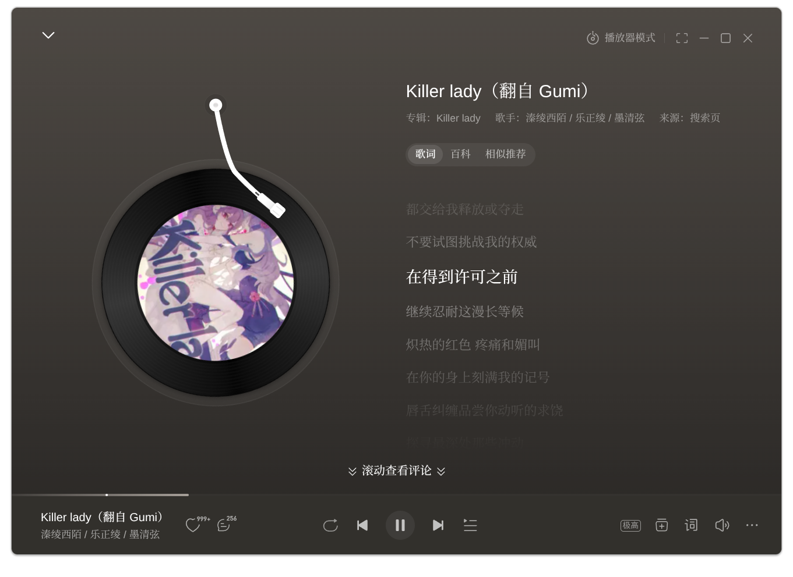
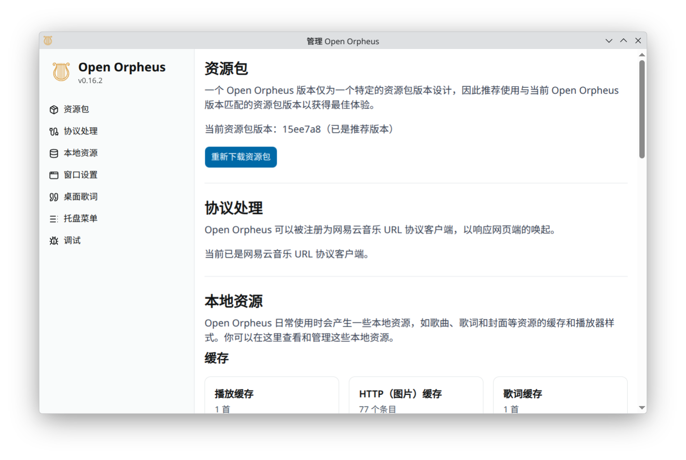

# Open Orpheus


[中文版](../README.md)

An open-source implementation of Netease Cloud Music's Orpheus browser host.

Upstream development plans: https://github.com/users/YUCLing/projects/3

## Features

- Native Nix builds for Linux (Wayland and X11) and macOS
  - Linux: x86_64 and aarch64; macOS: aarch64 (Apple Silicon) only
  - The pinned nixpkgs 26.11 removed Intel Mac support
  - Native CI checks builds and tests; graphical runtime behavior needs testing on each target system
  - No Windows or cross-compilation builds
- Open-source

What else do you expect! It just provides an environment for the original client!

## Screenshots

<details>
<summary>Main Interface</summary>


</details>

<details>
<summary>Playback Interface</summary>



</details>

<details>
<summary>Settings Interface</summary>



</details>

<details>
<summary>Mini Player & Desktop Lyrics</summary>


</details>

<details>
<summary>Mini Player List</summary>


</details>

## Installation

This repository maintains **Nix-only** packaging and releases. Its old distro installers, Copr, Flathub, AppImage, and Windows release pipelines have been removed. This does not imply that upstream or third-party distribution channels have stopped operating.

Install Nix with `nix-command` and `flakes` enabled, then run from the repository root:

```sh
nix build .#default # Same as nix build; creates result
nix run            # Build and launch
nix flake check    # Application build, tests, lint, and Rust checks
```

`packages.default` and `packages.open-orpheus` expose the same application; `apps.default` launches it. Builds target the native host: `x86_64-linux`, `aarch64-linux`, or `aarch64-darwin`, not a cross-compilation target.

[Releases](https://github.com/BIGGASSS/open-orpheus/releases) contain per-system `open-orpheus-SYSTEM.nar.zst` Nix runtime closures, not standalone installers. Importing and running them still requires Nix. See the [building guide](building.md) for setup, closure import, and troubleshooting.

### Development

```sh
nix develop
pnpm install --frozen-lockfile --ignore-scripts
pnpm build:modules
pnpm start
# Run checks in the same development environment
pnpm test
pnpm lint
```

pnpm and Cargo remain internal build tools in the Nix environment. Keep `pnpm-lock.yaml`, `Cargo.lock`, and `flake.lock` committed. See the [contributing guide](CONTRIBUTING_en.md).

### Resources

This project does not bundle some required resources because they are owned by NetEase.

Open Orpheus will **automatically download** the package from NetEase's CDN on first launch if it is missing, so manual setup is usually not required.

Resources are stored in the `package` subfolder of the data directory:

- Development: `data/package/` (relative to working directory)
- Packaged: `{userData}/package/`

#### `package` and `resource` folders

The entire `package` and `resource` folders are required.

If the automatic download fails, you can manually copy both folders from your official NetEase Cloud Music installation (e.g. `C:\path\to\your\installation\CloudMusic\package`) into the data directory above. **Note: `package` is a subfolder of the data directory's `package` folder, meaning the final structure should be `package/package/`!**

## Documentation

- [Nix building, running, and development](building.md)
- [Wayland window rules](WM_RULES.md)

## Disclaimer

Open Orpheus is an independent open-source project aimed at **interoperability**. It is not affiliated with, authorized by, or endorsed by NetEase in any way.

- **This project does not include or distribute any assets or code owned by NetEase.** Required resources such as `orpheus.ntpk` are the property of NetEase. Users must obtain them from a legally acquired official client installation, or allow the application to download them automatically from NetEase's official CDN on first launch.
- **This project does not provide, encourage, or support any functionality or modification intended to bypass advertisements, paid content, membership benefits, or digital rights management (DRM) mechanisms.** Any such use is explicitly outside the scope of this project and will be actively rejected.
- By using this project, you remain bound by the [NetEase Cloud Music Terms of Service](https://st.music.163.com/official-terms/service) and all applicable laws and regulations.
- This project is provided "as is". The maintainers accept no responsibility for any consequences arising from its use, including but not limited to account suspension, service disruption, or legal liability.

> "NetEase Cloud Music", "Orpheus", and related trademarks are the property of NetEase, Inc.
